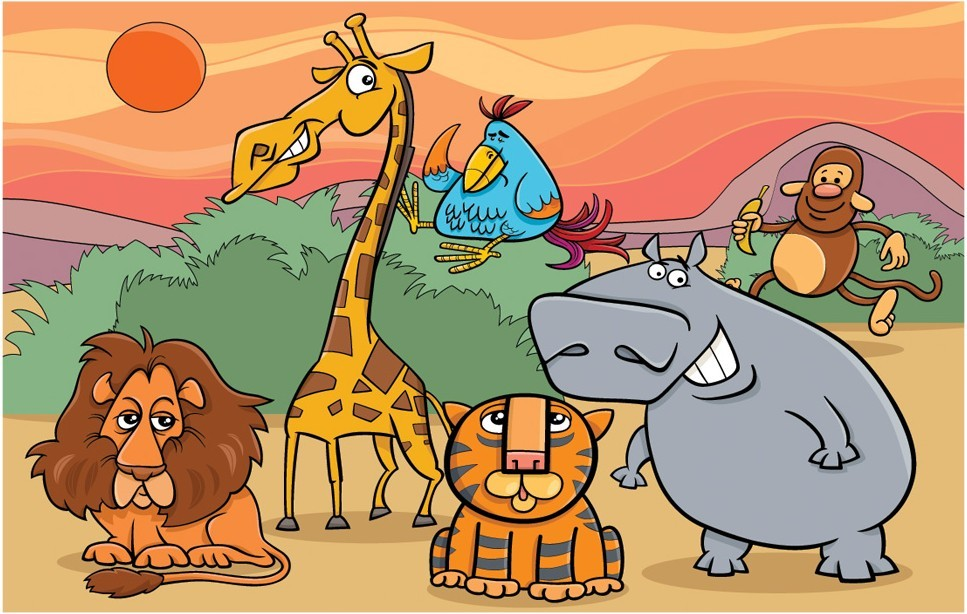
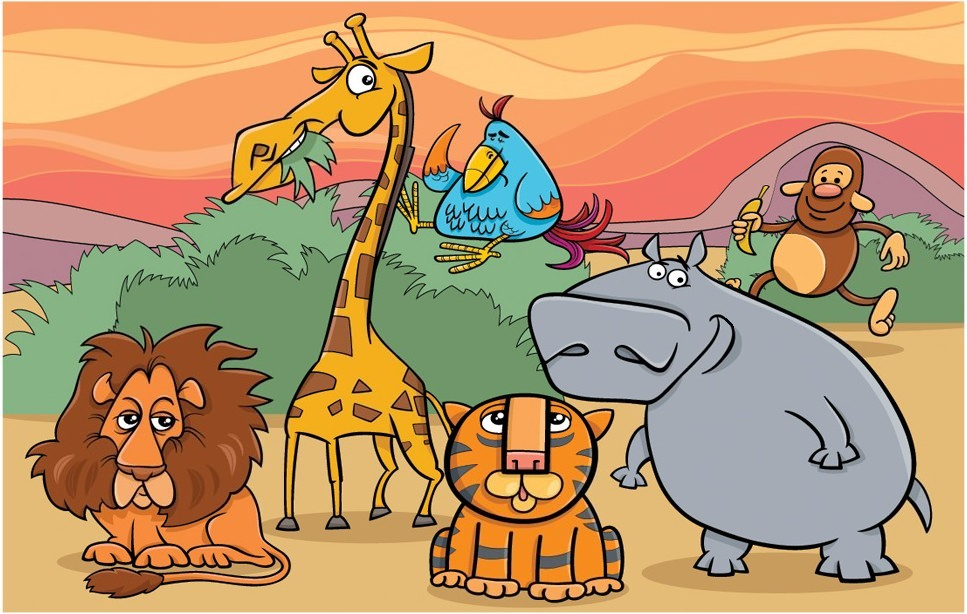

# Photo Hunt Solver

Photo Hunt also known as 'Spot the Difference Puzzle'. It is a puzzle in which two almost identical images are compared to find out the differences among them.
The project finds out the differences using OpenCV functions.

### Example : 

Image A

Image B

### Solution : 

